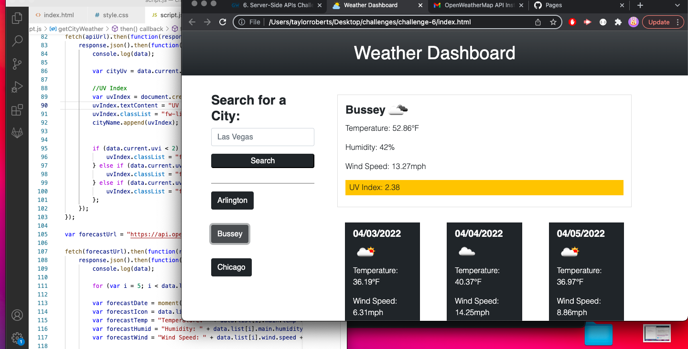

# Weather Dashboard

## Motivation 

- My motivation for this project was to create a simple, clean-looking weather dashboard that provided current conditions, as well as a five day forecast. The user is able to look up any city and be provided with weather for that area. 

## Problems

- When starting the JavaScript file I initially struggled to write the code to obtain certain responses from the API. However, once I was able to obtain the first response, calling the rest became easier as I went. 

- Another issue I ran into was formatting the dynamically created JavaScript elements. It took quite a bit of tweaking here and there but I was finally able to create a satisfying UI using Bootstrap.

- The final problem I have noted is that when searching commonly named cities, it doesn't necessarily fetch the city in the state that you might have wanted. For example, when searching 'Arlington',  instead of Arlington, Virginia it pulls up Arlington, Texas. In the future I hope to add a state qualifier so that the user is able to search exactly which city they are thinking of.

## What I Learned

- This project helped to solidify my knowledge of API calls and finding specific parameters. The act of obtaining parameters over and over was excellent pratice and I feel much more confident in my abilities to do so.

## What Makes This Project Stand Out

- This project stands out because it is very simplified and clean looking. I enjoy more modern and simple looking sites and I feel as though this application encapsulates that well. I also added a favicon for a more professional and polished look.

### Click [here](https://taystarr.github.io/weather-dashboard/) to try out my Weather Dashboard!